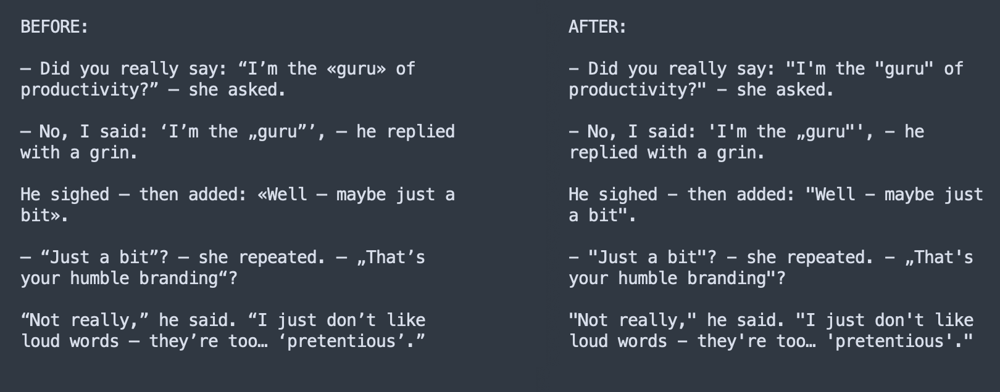

# 🧠 HumanizerTrayApp

**HumanizerTrayApp** is a small fan project built with [Avalonia](https://avaloniaui.net/) (.NET 8) for Windows and macOS.

It sits quietly in your system tray and — on click — processes your clipboard text, replacing all those smart quotes, fancy dashes, and typographic fluff introduced by ChatGPT, Word, Notion, and the like.

## 🔧 What it does

```csharp
public static string ApplyAllRules(string input)
{
    return input
        .Replace("—", "-")     // em dash
        .Replace("–", "-")     // en dash
        .Replace("−", "-")     // math minus
        .Replace("«", """)    // guillemet left
        .Replace("»", """)    // guillemet right
        .Replace("“", """)    // double curly quotes
        .Replace("”", """)
        .Replace("‘", "'")     // single curly quotes
        .Replace("’", "'");
}
```

## 💻 Why it exists

ChatGPT and many text editors like to replace standard ASCII characters with typographically “correct” symbols — dashes, quotes, etc.

But in code, Markdown, YAML, CLI, and other structured formats — these break things or simply get annoying.

**HumanizerTrayApp** fixes that with one click:  
copy → click → paste → done.

## 📎 Screenshot



## 📫 Feedback

This is a personal side project.  
But if you want to contribute rules or report a bug, [open an issue](https://github.com/kirilllemesev/HumanizerTrayApp/issues) or drop me a message at 'lemesev.kirill@gmail.com'
